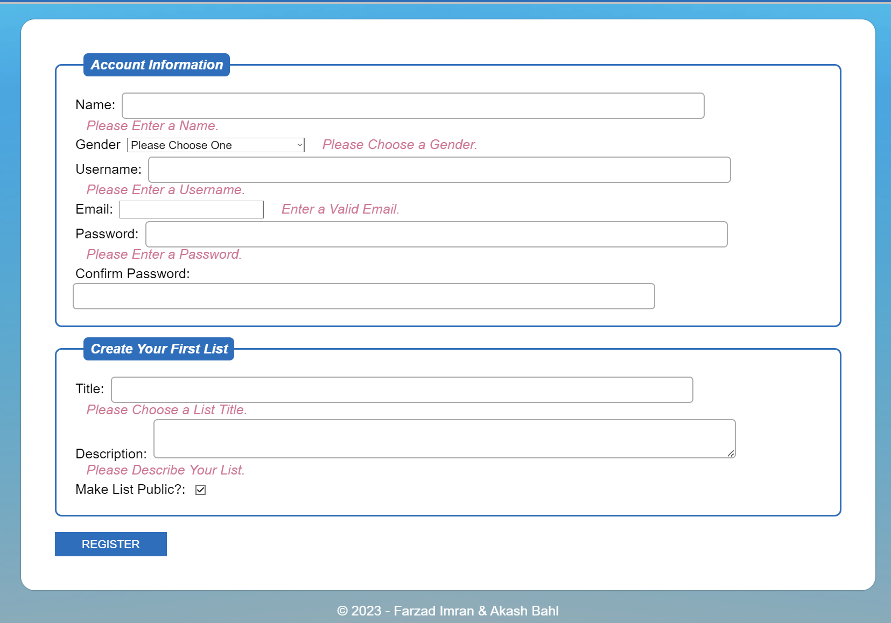
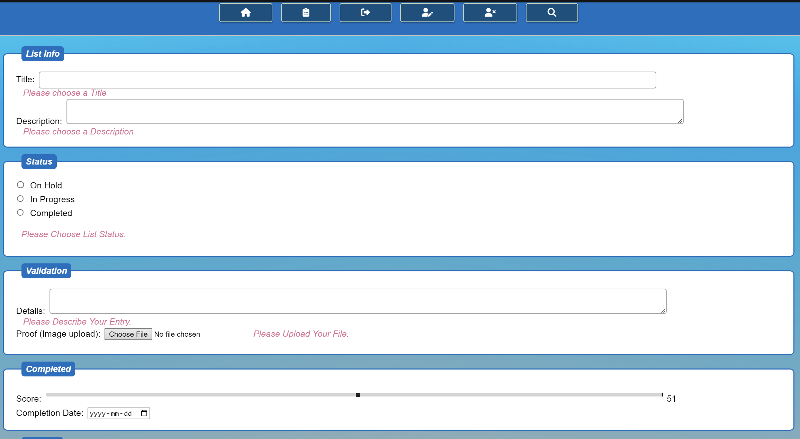
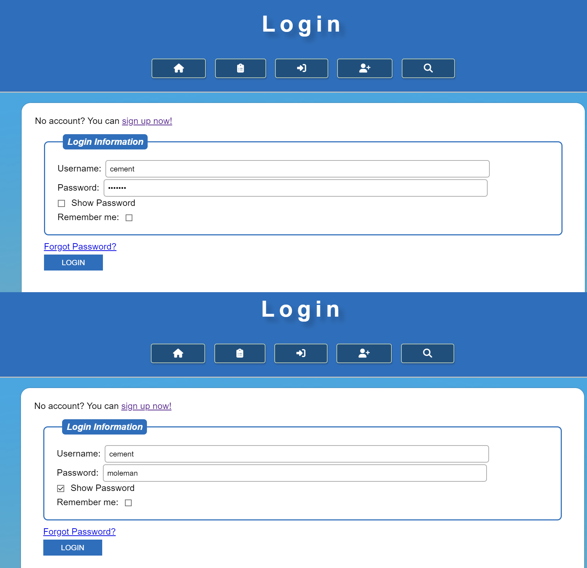

# 3420 Assignment #4 - Fall 2023

Name(s): Akash Bahl (0470368) Farzad Imran (0729901)

Live Loki link(s): <https://loki.trentu.ca/~demiimran/3420/assn/assn4/>

## Rubric

| Component                                                    | Grade |
| :----------------------------------------------------------- | ----: |
| Edit List Validation                                         |    /4 |
| Register Validation                                          |    /4 |
| Delete confirmation                                          |    /3 |
| Details modal                                                |    /5 |
|                                                              |       |
| Copy Public Link to Clipboard *                              |    /3 |
| Unique Username                                              |    /3 |
| Password Strength                                            |    /3 |
| Show Password *                                              |    /3 |
| Limiting Description Field *                                 |    /3 |
| Star Rating                                                  |    /3 |
|                                                              |       |
| Code Quality (tidyness, validity, efficiency, etc)           |    /4 |
| Documentation                                                |    /3 |
| Testing                                                      |    /3 |
|                                                              |       |
| Bonus                                                        |  /3.5 |
| Deductions (readability, submission guidelines, originality) |       |
|                                                              |       |
| Total                                                        |   /35 |

## Things to consider for Bonus Marks (if any)


## Code & Testing

Put your code and screenshots here, **with proper heading organization**. You don't need to include html/php code (or testing) for any pages that aren't affected by your javascript for this assignment.
```js
"use strict";

// constant fucntion to verify emails.
const checkEmail = str => /^[^\s@]+@[^\s@]+\.[^\s@]+$/.test(str);

// validation.js content
document.addEventListener('DOMContentLoaded', function () {

  // Register form validation
  const registerForm = document.getElementById('register-form');
  if (registerForm) {

    // input and error declaration
    const nameInput = document.getElementById('name');
    const nameError = nameInput.nextElementSibling;

    const genderSelect = document.getElementById('gender');
    const genderError = genderSelect.nextElementSibling;

    const userInput = document.getElementById('username');
    const userError = userInput.nextElementSibling;

    const emailInput = document.getElementById('email');
    const emailError = emailInput.nextElementSibling;

    const passwordInput = document.getElementById('password');
    const passwordError = passwordInput.nextElementSibling;

    const cpassInput = document.getElementById('confirm_password');
    const cpassError = cpassInput.nextElementSibling;

    const titleInput = document.getElementById('title');
    const titleError = titleInput.nextElementSibling;

    const descInput = document.getElementById('description');
    const descError = descInput.nextElementSibling;

    registerForm.addEventListener("submit", (ev) => {
      let errors = false;
      // If validation fails, prevent form submission with ev.preventDefault()

      if (nameInput.value !== "") {
        nameError.classList.add('hidden');
      } else {
        nameError.classList.remove('hidden');
        errors = true;
      }

      // check if there was nothing selected in the dropdown and handle appropriately
      if (genderSelect.value != 0) {
        genderError.classList.add('hidden');
      } else {
        genderError.classList.remove('hidden');
        errors = true;
      }

      if (userInput.value !== "") {
        userError.classList.add('hidden');
      } else {
        userError.classList.remove('hidden');
        errors = true;
      }

      // check if email is valid and handle appropriately
      if (checkEmail(emailInput.value)) {
        emailError.classList.add('hidden');
      } else {
        emailError.classList.remove('hidden');
        errors = true;
      }

      if (passwordInput.value !== "") {
        passwordError.classList.add('hidden');
      } else {
        passwordError.classList.remove('hidden');
        errors = true;
      }

      if (cpassInput.value == passwordInput.value) {
        cpassError.classList.add('hidden');
      } else {
        cpassError.classList.remove('hidden');
        errors = true;
      }

      if (titleInput.value !== "") {
        titleError.classList.add('hidden');
      } else {
        titleError.classList.remove('hidden');
        errors = true;
      }

      if (descInput.value !== "") {
        descError.classList.add('hidden');
      } else {
        descError.classList.remove('hidden');
        errors = true;
      }

        // IF THERE ARE ERRORS, PREVENT FORM SUBMISSION
        if (errors)
        ev.preventDefault();
    });
  }
});


// validation.js content
document.addEventListener('DOMContentLoaded', function () {
  // Edit item form validation
  const editItemForm = document.getElementById('edit-form');
  if (editItemForm) {
    // input and error declaration
    const titleInput = document.getElementById('title');
    const titleError = titleInput.nextElementSibling;

    const descInput = document.getElementById('description');
    const descError = descInput.nextElementSibling;

    const statusButtons = Array.from(document.getElementsByName('status'));
    const statusError = statusButtons[2].closest('div').nextElementSibling;

    const detailsInput = document.getElementById('details');
    const detailsError = detailsInput.nextElementSibling;

    const proofInput = document.getElementById('proof');
    const proofError = proofInput.nextElementSibling;

    editItemForm.addEventListener("submit", (ev) => {
      let errors = false;
      // if validation fails prevent form submission

      if (titleInput.value !== "") {
        titleError.classList.add('hidden');
      } else {
        titleError.classList.remove('hidden');
        errors = true;
      }

      if (descInput.value !== "") {
        descError.classList.add('hidden');
      } else {
        descError.classList.remove('hidden');
        errors = true;
      }

      if (statusButtons.some(button => button.checked)) {
        statusError.classList.add('hidden');
      } else {
        statusError.classList.remove('hidden');
        errors = true;
      }

      if (detailsInput.value !== "") {
        detailsError.classList.add('hidden');
      } else {
        detailsError.classList.remove('hidden');
        errors = true;
      }

      if (proofInput.files.length != 0) {
        proofError.classList.add('hidden');
      } else {
        proofError.classList.remove('hidden');
        errors = true;
      }

        // IF THERE ARE ERRORS, PREVENT FORM SUBMISSION
        if (errors)
        ev.preventDefault();
    });
  }
    // Get the modal
    var modal = document.getElementById("myModal");

    // Get the button that opens the modal
    var listLink = document.getElementById("preview");

    // Get the <span> element that closes the modal
    var span = document.getElementsByClassName("close")[0];

    // When the user clicks on the button, open the modal
    listLink.addEventListener('click', showModalPopUp);
    
    function showModalPopUp() {
      $('#myModal').modal('show');
      var options = {
        url: listLink.dataset.content, //Set the url of the page
        title: 'View Item', //Set the title for the pop up
        allowMaximize: false,
        showClose: true,
      width: 600,
      height: 400
    };

    //Invoke the modal dialog by passing in the options array variable
    SP.SOD.execute('sp.ui.dialog.js', 'SP.UI.ModalDialog.showModalDialog', options);
    }

    // When the user clicks on <span> (x), close the modal
    span.onclick = function() {
      modal.style.display = "none";
    }

    // When the user clicks anywhere outside of the modal, close it
    window.onclick = function(event) {
      if (event.target == modal) {
        modal.style.display = "none";
      }
    }
    const copyLinkBtn = document.getElementById('copyLinkBtn');

    if (copyLinkBtn) {
      copyLinkBtn.addEventListener('click', function () {
        const listItem = this.closest('li');
        const listLink = listItem.querySelector('a');
        const publicListLink = window.location.origin + '/view-item.php?id=' + encodeURIComponent(list_id); // Replace listId with the actual list ID
        copyToClipboard(publicListLink);
        alert('Public list link copied to clipboard!');
      });
    }
  
    function copyToClipboard(text) {
      const textarea = document.createElement('textarea');
      textarea.value = text;
      document.body.appendChild(textarea);
      textarea.select();
      document.execCommand('copy');
      document.body.removeChild(textarea);
    }
  
  
    function Toggle() {
      let temp = document.getElementById("password");
    
      if (temp.type === "password") {
        temp.type = "text";
      } else {
        temp.type = "password";
      }
    }

  });

```

# login.php
```xml
<!--PHP section-->
<?php
require './includes/library.php';
session_start(); // Start the session

// Check if the user is already logged in, if so, redirect to the Main Page
if (isset($_SESSION['username'])) {
    header("Location: index.php");
    exit();
}

// Check if a cookie exists, if yes, pre-populate the username box
if (isset($_COOKIE['remember_me'])) {
    $prepopulatedUsername = $_COOKIE['remember_me'];
} else {
    $prepopulatedUsername = '';
}

// Check if the form is submitted
if ($_SERVER["REQUEST_METHOD"] == "POST") {
  $pdo = connectDB();
  $username = $_POST['username'];
  $password = $_POST['password'];

  // Sanitize all text inputs
  $username= htmlspecialchars($username);
  $password= htmlspecialchars($password);

  $rememberMe = isset($_POST['remember_me']) ? $_POST['remember_me'] : false;

  // Fetch user data from the database
  $stmt = $pdo->prepare("SELECT id, password FROM 3420_assg_users WHERE username = ?");
  $stmt->execute([$username]);
  $userData = $stmt->fetch();

  // Verify password
  if ($userData && password_verify($password, $userData['password'])) {
      // Password is correct, start a new session
      session_start();

      // Store user data in session variables
      $_SESSION['username'] = $username;
      $_SESSION['user_id'] = $userData['id'];

      // Create a cookie if "remember me" is checked
      if ($rememberMe) {
          setcookie('remember_me', $username, time() + (86400 * 30), "/"); // 30 days
      } else {
          // If "remember me" is not checked, clear the cookie
          setcookie('remember_me', '', time() - 3600, "/");
      }

      // Redirect to the Main Page
      header("Location: index.php");
      exit();
  } else {
      $error_message = "Invalid username or password";
  }
}
?>

<!DOCTYPE html>
<html lang="en">
  <head>
    <meta charset="UTF-8">
    <meta name="viewport" content="width=device-width, initial-scale=1.0">
    <script
      src="https://kit.fontawesome.com/05ad49203b.js"
      crossorigin="anonymous"
    ></script>
    <title>Login</title>
    <!-- include javascript and css-->
    <link rel="stylesheet" href="styles/main.css">
    <script defer src="js/scripts.js"></script>
  </head>
  <body>
    <header>
      <!--This will be the main heading of the page so users know what page they're on-->
      <h1>Login</h1>

      <?php include './includes/nav.php' ?>
    </header>
    <main>
    <?php
      if (isset($error_message)) {
          echo "<p>$error_message</p>";
      }
      ?>
      No account? You can <a href="register.php">sign up now!</a>
      <form id="login-form" action="login.php" method="post" class="login">
        <fieldset>
          <legend>Login Information</legend>
          <div>
            <label for="username">Username:</label>
            <input
              type="text"
              id="username"
              name="username"
              maxlength="32"
              placeholder="ex. JohnDoe123"
              required
            >
          </div>
          <div>
            <label for="password">Password:</label>
            <input type="password" id="password" name="password" required>
            <input type="checkbox" id="showPassword" onclick="Toggle()"> <!-- Use the provided function to toggle password visibility -->
            <label for="showPassword">Show Password</label>
          </div>
          <script>function Toggle() {
    let temp = document.getElementById("password");
  
    if (temp.type === "password") {
      temp.type = "text";
    } else {
      temp.type = "password";
    }
  }
  </script>

          <div>
            <label for="remember_me">Remember me:</label>
            <input type="checkbox" id="remember_me" name="remember_me">
          </div>
        </fieldset>
        <div>
          <a href="forgot.php">Forgot Password?</a>
        </div>
        <input type="submit" value="Login">
      </form>
    </main>
    <?php include './includes/footer.php' ?>
  </body>
</html>
```

## image tests
Javascript form validation for register

javascript was able to stop the form from submitting and display all errors upon attempting to submit an enpty form with the php validation commented out.


Javascript form validation for edit-list item

javascript was able to stop the form from submitting and display all errors upon attempting to submit an enpty form with the php validation commented out.

Modal window for index/public list

This feature did not work with the code we have tried, perhaps it is because we implemented the code wrong, or some issue we were unaware of.

Show password


By hitting the checkbox you are able to display the password you typed in, useful for people who have autofill on and can't remember their password :D